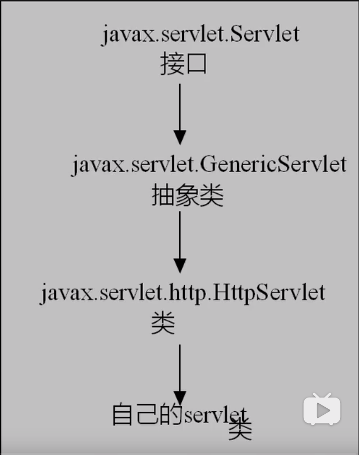
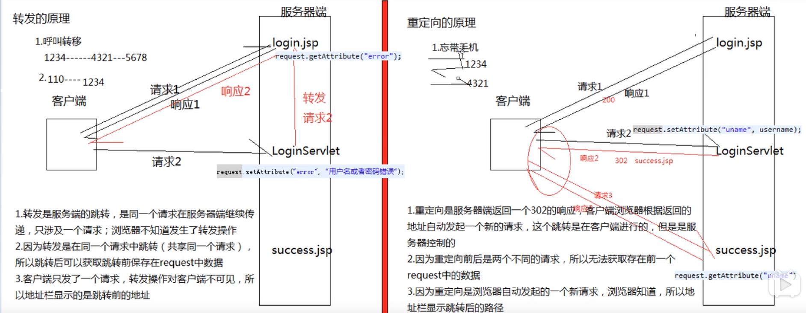

# Servlet

## 1.使用Servlet开发动态网页（已过时）

**第一个动态网页**

---

java类：

~~~java
package HttpServlet;

import java.io.IOException;
import java.io.PrintWriter;
import javax.servlet.ServletException;
import javax.servlet.http.HttpServlet;
import javax.servlet.http.HttpServletRequest;
import javax.servlet.http.HttpServletResponse;

public class firstServlet extends HttpServlet {
	
	/**
	 * 每次访问都需要执行的方法
	 */
	@Override
	protected void service(HttpServletRequest request, HttpServletResponse response) 
			throws ServletException, IOException {
		
		//解决POST请求的表单提交产生的中文乱码问题
		response.setCharacterEncoding("utf-8");
        
        //解决浏览器页面产生的中文乱码问题
		response.setContentType("text/html;charset=utf-8");
		
		//从response获得一个printWriter对象，可以向网页输出内容
		PrintWriter out = response.getWriter();
		
		//输出界面
		out.println("<html>");
		out.println("<head>");
		out.println("</head>");
		out.println("<body>");
		out.println("
" + "第一个servlet页面" + "
");
		out.println("</body>");
		out.println("</html>");
		
		//关闭printWriter对象
		out.close();
	}
}
~~~

web.xml配置界面

~~~xml
<?xml version="1.0" encoding="UTF-8"?>
<web-app xmlns:xsi="http://www.w3.org/2001/XMLSchema-instance" xmlns="http://xmlns.jcp.org/xml/ns/javaee" xsi:schemaLocation="http://xmlns.jcp.org/xml/ns/javaee http://xmlns.jcp.org/xml/ns/javaee/web-app_3_1.xsd" id="WebApp_ID" version="3.1">
  <display-name>myServlet</display-name>
  <!--欢迎界面列表，按顺序依次进行匹配-->
  <welcome-file-list>
    <welcome-file>index.html</welcome-file>
    <welcome-file>index.htm</welcome-file>
    <welcome-file>index.jsp</welcome-file>
    <welcome-file>default.html</welcome-file>
    <welcome-file>default.htm</welcome-file>
    <welcome-file>default.jsp</welcome-file>
  </welcome-file-list>
  
  <servlet>
  	<servlet-name>firstServlet</servlet-name>
  	<servlet-class>HttpServlet.firstServlet</servlet-class>
  </servlet>
  <servlet-mapping>
  	<servlet-name>firstServlet</servlet-name>
  	<url-pattern>/servlet/firstServlet</url-pattern>
  </servlet-mapping>

</web-app>
~~~

## 2.使用Servlet进行流程控制

## 3.Servlet的生命周期

**代码实例：**

---

~~~java
package lifeServlet;

import java.io.IOException;
import javax.servlet.Servlet;
import javax.servlet.ServletConfig;
import javax.servlet.ServletException;
import javax.servlet.ServletRequest;
import javax.servlet.ServletResponse;

public class lifeServlet implements Servlet{

	static {
		System.out.println("类被加载");
	}
	/*
	 * Servlet是单实例对象，不管多少用户访问，只创建一次对象
	 */
	public lifeServlet() {
		System.out.println("Servlet对象已经被创建");
	}

	/**
	 * init进行初始化操作，同样无论多少个用户访问，都只执行一次，在创建完对象之后执行
	 */
	@Override
	public void init(ServletConfig arg0) throws ServletException {
		System.out.println("调用了init()方法");
	}

	/**
	 * 每次访问都会执行一次
	 */
	@Override
	public void service(ServletRequest request, ServletResponse response) 
			throws ServletException, IOException {
		System.out.println("service()方法被执行");
	}
	
	/**
	 * 只执行一次，销毁对象之前执行，执行扫尾操作
	 */
	@Override
	public void destroy() {
		System.out.println("destroy()方法被执行");
	}

	@Override
	public String getServletInfo() {
		// TODO Auto-generated method stub
		return null;
	}
	
	@Override
	public ServletConfig getServletConfig() {
		// TODO Auto-generated method stub
		return null;
	}
}

//执行结果
/**
类被加载
Servlet对象已经被创建
调用了init()方法
service()方法被执行
service()方法被执行
service()方法被执行
destroy()方法被执行
 */
~~~

**方法介绍：**

---

init（）方法：在一个Servlet的生命周期中，init()方法只会被执行一次，之后无论用户执行多少次请求，都不会在调用该方法。 关于init方法的执行时机，有两种方式可选，一是在服务器启动后第一个用户请求该Servlet的是时候调用；二是设置该Servlet在服务器启动后自动执行。 init()方法负责简单的创建或者加载一些数据，这些数据将用于该Servlet的整个生命周期中。

service（）方法：当一个客户请求改Servlet时，实际的处理工作全部有service（）方法来完成，service（）方法用来处理客户端的请求，并生成格式化数据返回给客户端。 每一次请求服务器都会开启一个新的线程并执行一次service（）方法，service（）方法根据客户端的请求类型，调用doGet、doPost等方法。 service（）是由web容器来调用的，我们无需对service（）具体内容做任何处理，service（）会自动的根据客户端的请求类型去调用doGet（）、doPost（）等方法，所以我们只需要做好doGet（）、doPost（）方法的实现就可以了。

destroy（）方法：该方法在整个生命周期中，也是只会被调用一次，在Servlet对象被销毁是调用，在servlet中，我们可以做一些资源的释放等操作，执行destory（）方法之后的servlet对象，会等待jvm虚拟机的垃圾回收机制择时回收。

doGet（）、doPost（）方法：实际的业务处理流程，service根据客户端的请求类型来自动匹配需要执行那个方法。调用service（）方法，也是间接的调用这两个方法。

**Servlet的执行流程：**

---

使用到的技术：xml的解析和反射

> 开始：客户端发起请求，http://localhost:8080/myservlet/servlet/lifeServlet
>
> 类的加载：
>
> 1. 截取URL中的servlet路径：/servlet/lifeServlet，
> 2. 在web.xml中查找\<url-pattern\>的值是/servlet/lifeServlet的标签，如果找不到，报404错误
> 3. 如果找到了，获取\<servlet-name>中的值lifeServlet（举例而已），然后根据获得的值，在\<servlet>标签中查找\<servlet-name>的值同样为lifeServlet的\<servlet>，获取同级的\<servlet-class>的值lifeServlet.lifeServlet
> 4. 根据类名（全名，加路径的）获得该类，反射
>
> 创建Servlet对象（类的实例化）：
>
> 1. 通过反射，调用该类无参的构造方法实例化对象
>
> 调用init（）方法进行初始化：
>
> 1. 通过反射机制调用init（）方法
>
> 调用service（）方法：
>
> 1. 通过反射机制调用service（）方法
>
> 调用destroy（）方法：
>
> 1. 同样通过反射机制

注意：Servlet的实例化时间和配置相关：

> 具体什么时候加载需要通过web.xml配置文件中，对应Servlet设置项的\<load-on-startup>节点进行设置
>
> 1. 标记容器是否在启动的时候就加载这个servlet
> 2. 当值为0或者大于0时，表示容器在应用启动时就加载这个servlet
> 3. 当是一个负数时或者没有指定时，则指示容器在该servlet被选择时才加载

**生命周期：**

---

1. 加载类和实例化
2. 初始化
3. 处理请求
4. 销毁

图示：

**xml是什么：**

---

xml是可扩展标记语言，和HTML语言的不同点：1）HTML标签的含义是固定的，xml中的标签的含义是自定义的；2）作用不同：HTML标签中的内容是网页内容，由浏览器进行解释，而xml中的内容用来存储数据（比如一些配置信息等）；3）HTML语法不严格，xml语法严格。

**Servlet类加载的时机：**

---

1. 客户端发起请求
2. 项目启动的时候进行加载，在web.xml中的\<servlet>\</servlet>标签下配置\<load-on-startup>1\</load-on-startup>，数字越小，越先被加载。

## 4.Servlet的继承关系

如图：

> Servlet：一个接口，内部有五个未被实现的方法，分别为：
>
> public void init(ServletConfig config) throws ServletException;
>
> public ServletConfig getServletConfig();
>
> public void service(ServletRequest req, ServletResponse res) throws ServletException, IOException;
>
> public String getServletInfo();
>
> public void destroy();
>
> GenericServlet：一个抽象类，除了service（）方法以外，其他的方法进行了空实现，子类必修实现service（）方法
>
> public abstract void service(ServletRequest req, ServletResponse res) throws ServletException, IOException;
>
> HttpServlet：抽象类，继承自GenericServlet类，虽然内部的方法已经全部得到实现，但是为了防止用其创建对象，故定义为抽象类。

注：一般的开发过程中直接继承HttpServlet，重写service（）方法即可。

## 5.请求和响应

### 1.项目名称和上下文路径

> 上下文路径
>
> 1. context就是“容器”，放的就是应用程序的所有资源，要用时候就访问它，所以context里面的东西，在同一个应用程序里面是全局的；web上下文可以看成web应用的运行环境，一般用context名字来修饰，里面保存了web应用相关的一些设置和全局变量。
> 2. ServletContext,是一个全局的储存信息的空间，服务器开始，其就存在，服务器关闭，其才释放。request，一个用户可有多个；session，一个用户一个；而servletContext，所有用户共用一个。所以，为了节省空间，提高效率，ServletContext中，要放必须的、重要的、所有用户需要共享的线程又是安全的一些信息；
> 3. Java Web中的上下文环境概念就是：一个web服务启动后的整个服务中的所有内存对象和他们之间的关系组成的一种环境
>
> 项目名称
>
> 1. 在java Web中默认上下文环境为项目名称。

### 2.解决中文乱码问题

**处理POST请求：**

添加以下语句：

~~~java
response.setCharacterEncoding("utf-8");
~~~

**处理浏览器页面产生的中文乱码问题：**

添加以下语句：

~~~java
response.setContentType("text/html;charset=utf-8");
~~~

**处理get请求产生的乱码问题：**

方法一：添加以下语句

~~~java
//以iso-8859-1的编码格式解码为字节数组
byte[] bytes = str.getBytes("iso-8859-1");
//以utf-8的编码格式重新对字节数组进行编码
String text = new String(bytes, "utf-8");
~~~

方法二：在server.xml中添加配置

~~~html
URIEncoding = "utf-8"
~~~

### 3.用户提交请求的两种方法GET和POST

用户提交请求主要有两种方法GET和POST：

1）GET是不安全的，因为在传输的过程中，数据被放在请求的URL中；POST请求对于用户来说则是不可见的。

2）GET请求的传送的数据量较小，因为受到URL的长度限制；POST传送的数据量较大，一般被默认为不受限制。

3）GET请求可以被缓冲；GET请求可以被收藏为书签，POST请求不可以。

4）GET的执行效率比POST高

5）GET是form提交的默认方法

6）超链接请求和地址栏的请求均是GET方法。

### 4.转发和重定向

**客户端控制（用户控制）的两种跳转方式：**

----

1）点击超链接

2）提交表单

本质：都是客户端向服务器端发送了一个新的请求

**服务器端控制（程序控制）的两种跳转方式：**

---

1）转发：dispatcher

2）重定向：redirect

**转发和重定向的共同点：**

---

都实现了跳转

**转发和重定向的区别：**

---

1）语法不同：

转发：**request**.getRequestDispatcher("Path").forward(request, response);---------->转发使用request

重定向：**response**.sendRedirect("Path"); --------------->重定向使用response

2）跳转之后是否可以获取request中的内容：

转发：可以，因为前后使用的是同一个request，（使用setAttribute（）和getAttribute）

重定向：不可以，因为前后使用的不是同一个request

3）跳转后地址栏的路径不同：

转发：[path1] --------> path2，转发对于用户（客户端）来说是透明的

重定向：path1 ---------> [path2]，对于用户（客户端）来说，不透明

**4）原理不同（根）：**

5）跳转的范围不同：

（1）转发：一般只是在当前项目进行跳转。

（2）重定向：可以在整个互联网进行跳转。

6）请求转发可以用来共享参数

~~~java
//该参数被保存在服务器端
request.setAttribute(String,Object);
request.getAttribute(String),返回Object
~~~

请求重定向不可以进行共享参数

**7）路径问题**

**（1）转发：**

~~~java
//1.不可以使用绝对路径，即使是在当前目录

//2.使用根路径，不需要写上下文路径，该处的/代表的是当前项目的根路径，即http://localhost:8080/上下文路径/
request.getRequestDispatcher(/.....);

//3.相对路径，只能相对于自身文件
~~~

注意：转发建议使用根路径，转发只能在当前项目进行跳转

**（2）重定向：**

~~~java
//1.绝对路径，完全可以，直接http开头

//2.根路径，需要写上下文路径，该处的/代表的是当前服务器的根目录，即http://localhost:8080/
response.sendRedirect(/......);

//3.相对路径，同样只能相对于当前文件自身，不能相对于basePath
~~~

注意：重定向，可以访问当前服务器下的所有项目。仍然建议使用根路径。

## 6.常见的路径问题

**绝对路径**

---

以http开头的完整路径， 可以访问所有服务器上的所有项目的所有资源（即网络上的所有资源）

格式：

1）访问本服务器资源：http:// [ip] + [port] + [上下文环境] + [/] + [webRoot目录下的文件的路径]

2）访问网络资源：直接网络上的URL

**根路径**

---

以/开头的路径，可以访问当前服务器上的所有项目的资源，/代表当前服务器的根路径。

格式：[上下文环境] + [/] + [webRoot目录下的文件的路径]

不可以用来访问其他服务器上的资源

**相对路径**（两种）

---

相对路径1：相对于当前文件自身，可以用来访问当前服务器上所有项目的资源

> 从当前文件开始，通过./或者../的方式访问该服务器下其他项目的资源

相对路径2：相对于basePath，basePath = http:// [ip] + [port] + [上下文环境] + [/]

> 从基准路径basePath开始，通过./或者../的方式访问该服务器下的其他项目的资源

同样，相对路径不可以用来访问其他服务器上的资源

**总结**

---

如果要访问其他服务器上的资源只可以使用绝对路径

如果访问当前服务器上的其他项目，建议使用根路径

如果访问当前服务器上的当前项目，建议使用相对路径，并且是基于basePath的相对路径

当前项目的根路径：D:\tomcat\apache-tomcat-8.5.37-windows-x64\apache-tomcat-8.5.37\webapps \myServlet ------->**注意：不加/**

当前服务器的根路径：D:\tomcat\apache-tomcat-8.5.37-windows-x64\apache-tomcat-8.5.37\webapps

注意：

1）上述两个根目录可以进行修改

2）以上所有的路径规则仅适用于：标签a，form-action，img，js，css，link

3）以上路径不适用于：JSP的动态内容路径：例如转发和重定向，include等。

