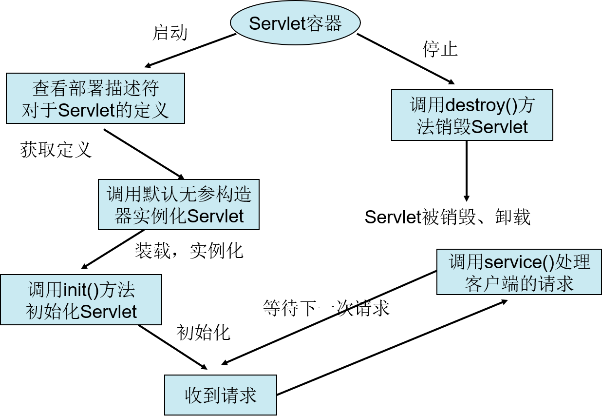

# Servlet

## 1.使用Servlet开发动态网页（已过时）

**第一个动态网页**

---

java类：

~~~java
package HttpServlet;

import java.io.IOException;
import java.io.PrintWriter;
import javax.servlet.ServletException;
import javax.servlet.http.HttpServlet;
import javax.servlet.http.HttpServletRequest;
import javax.servlet.http.HttpServletResponse;

public class firstServlet extends HttpServlet {
	
	/**
	 * 每次访问都需要执行的方法
	 */
	@Override
	protected void service(HttpServletRequest request, HttpServletResponse response) 
			throws ServletException, IOException {
		
		//解决中文乱码问题
		response.setCharacterEncoding("utf-8");
		response.setContentType("text/html;charset=utf-8");
		
		//从response获得一个printWriter对象，可以向网页输出内容
		PrintWriter out = response.getWriter();
		
		//输出界面
		out.println("<html>");
		out.println("<head>");
		out.println("</head>");
		out.println("<body>");
		out.println("
" + "第一个servlet页面" + "
");
		out.println("</body>");
		out.println("</html>");
		
		//关闭printWriter对象
		out.close();
	}
}
~~~

web.xml配置界面

~~~xml
<?xml version="1.0" encoding="UTF-8"?>
<web-app xmlns:xsi="http://www.w3.org/2001/XMLSchema-instance" xmlns="http://xmlns.jcp.org/xml/ns/javaee" xsi:schemaLocation="http://xmlns.jcp.org/xml/ns/javaee http://xmlns.jcp.org/xml/ns/javaee/web-app_3_1.xsd" id="WebApp_ID" version="3.1">
  <display-name>myServlet</display-name>
  <!--欢迎界面列表，按顺序依次进行匹配-->
  <welcome-file-list>
    <welcome-file>index.html</welcome-file>
    <welcome-file>index.htm</welcome-file>
    <welcome-file>index.jsp</welcome-file>
    <welcome-file>default.html</welcome-file>
    <welcome-file>default.htm</welcome-file>
    <welcome-file>default.jsp</welcome-file>
  </welcome-file-list>
  
  <servlet>
  	<servlet-name>firstServlet</servlet-name>
  	<servlet-class>HttpServlet.firstServlet</servlet-class>
  </servlet>
  <servlet-mapping>
  	<servlet-name>firstServlet</servlet-name>
  	<url-pattern>/servlet/firstServlet</url-pattern>
  </servlet-mapping>

</web-app>
~~~

## 2.使用Servlet进行流程控制

## 3.Servlet的生命周期

**代码实例：**

---

~~~java
package lifeServlet;

import java.io.IOException;
import javax.servlet.Servlet;
import javax.servlet.ServletConfig;
import javax.servlet.ServletException;
import javax.servlet.ServletRequest;
import javax.servlet.ServletResponse;

public class lifeServlet implements Servlet{

	static {
		System.out.println("类被加载");
	}
	/*
	 * Servlet是单实例对象，不管多少用户访问，只创建一次对象
	 */
	public lifeServlet() {
		System.out.println("Servlet对象已经被创建");
	}

	/**
	 * init进行初始化操作，同样无论多少个用户访问，都只执行一次，在创建完对象之后执行
	 */
	@Override
	public void init(ServletConfig arg0) throws ServletException {
		System.out.println("调用了init()方法");
	}

	/**
	 * 每次访问都会执行一次
	 */
	@Override
	public void service(ServletRequest request, ServletResponse response) 
			throws ServletException, IOException {
		System.out.println("service()方法被执行");
	}
	
	/**
	 * 只执行一次，销毁对象之前执行，执行扫尾操作
	 */
	@Override
	public void destroy() {
		System.out.println("destroy()方法被执行");
	}

	@Override
	public String getServletInfo() {
		// TODO Auto-generated method stub
		return null;
	}
	
	@Override
	public ServletConfig getServletConfig() {
		// TODO Auto-generated method stub
		return null;
	}
}

//执行结果
/**
类被加载
Servlet对象已经被创建
调用了init()方法
service()方法被执行
service()方法被执行
service()方法被执行
destroy()方法被执行
 */
~~~

**方法介绍：**

---

init（）方法：在一个Servlet的生命周期中，init()方法只会被执行一次，之后无论用户执行多少次请求，都不会在调用该方法。 关于init方法的执行时机，有两种方式可选，一是在服务器启动后第一个用户请求该Servlet的是时候调用；二是设置该Servlet在服务器启动后自动执行。 init()方法负责简单的创建或者加载一些数据，这些数据将用于该Servlet的整个生命周期中。

service（）方法：当一个客户请求改Servlet时，实际的处理工作全部有service（）方法来完成，service（）方法用来处理客户端的请求，并生成格式化数据返回给客户端。 每一次请求服务器都会开启一个新的线程并执行一次service（）方法，service（）方法根据客户端的请求类型，调用doGet、doPost等方法。 service（）是由web容器来调用的，我们无需对service（）具体内容做任何处理，service（）会自动的根据客户端的请求类型去调用doGet（）、doPost（）等方法，所以我们只需要做好doGet（）、doPost（）方法的实现就可以了。

destroy（）方法：该方法在整个生命周期中，也是只会被调用一次，在Servlet对象被销毁是调用，在servlet中，我们可以做一些资源的释放等操作，执行destory（）方法之后的servlet对象，会等待jvm虚拟机的垃圾回收机制择时回收。

doGet（）、doPost（）方法：实际的业务处理流程，service根据客户端的请求类型来自动匹配需要执行那个方法。调用service（）方法，也是间接的调用这两个方法。

**Servlet的执行流程：**

---

使用到的技术：xml的解析和反射

> 开始：客户端发起请求，http://localhost:8080/myservlet/servlet/lifeServlet
>
> 类的加载：
>
> 1. 截取URL中的servlet路径：/servlet/lifeServlet，
> 2. 在web.xml中查找\<url-pattern\>的值是/servlet/lifeServlet的标签，如果找不到，报404错误
> 3. 如果找到了，获取\<servlet-name>中的值lifeServlet（举例而已），然后根据获得的值，在\<servlet>标签中查找\<servlet-name>的值同样为lifeServlet的\<servlet>，获取同级的\<servlet-class>的值lifeServlet.lifeServlet
> 4. 根据类名（全名，加路径的）获得该类，反射
>
> 创建Servlet对象（类的实例化）：
>
> 1. 通过反射，调用该类无参的构造方法实例化对象
>
> 调用init（）方法进行初始化：
>
> 1. 通过反射机制调用init（）方法
>
> 调用service（）方法：
>
> 1. 通过反射机制调用service（）方法
>
> 调用destroy（）方法：
>
> 1. 同样通过反射机制

图示：

**xml是什么：**

---

xml是可扩展标记语言，和HTML语言的不同点：1）HTML标签的含义是固定的，xml中的标签的含义是自定义的；2）作用不同：HTML标签中的内容是网页内容，由浏览器进行解释，而xml中的内容用来存储数据（比如一些配置信息等）；3）HTML语法不严格，xml语法严格。

**Servlet类加载的时机：**

---

1. 客户端发起请求
2. 项目启动的时候进行加载，在web.xml中的\<servlet>\</servlet>标签下配置\<load-on-startup>1\</load-on-startup>，数字越小，越先被加载。