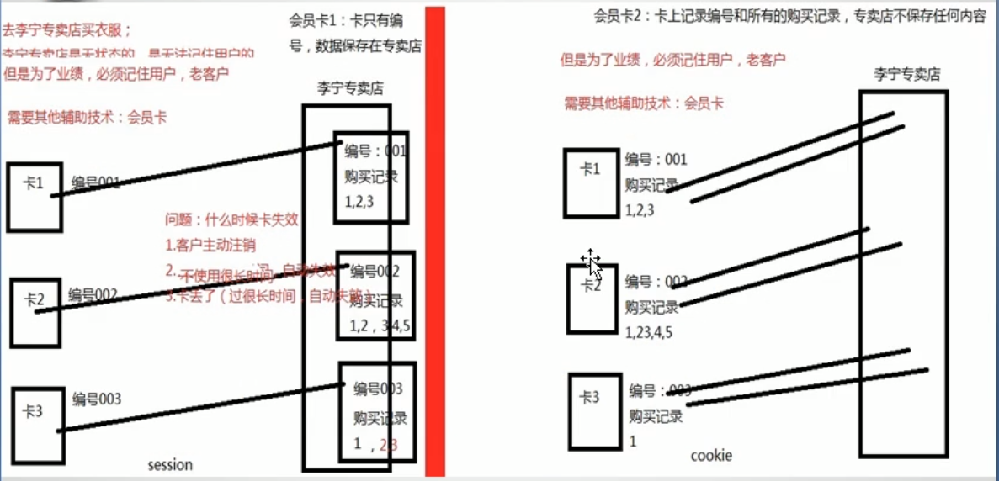
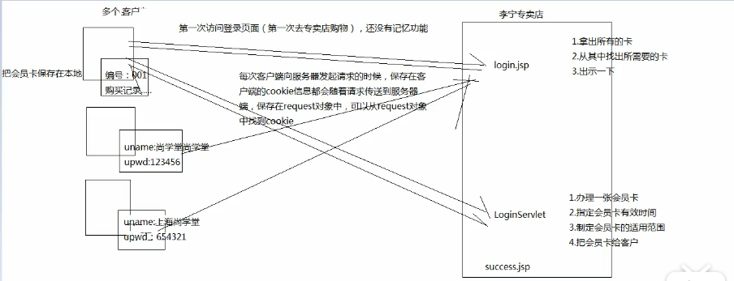

# 会话管理

## 1. 为什么采用会话管理

**解决Http的无状态问题：**

Http是无状态的协议，客户每次读取web页面时，服务器都需要打开新的链接，而且服务器也不会自动维护客户的上下文信息

**两种解决方案：**

1. 采用cookie将信息保存在客户端解决
2. 采用session将信息保存在服务器端解决

**两种解决方案的原理图解：**

## 2.Cookie的使用

### 2.1 图解 

### 2.2具体实现

**1. TestCookies在服务器端的工作流程：**

1. 接收用户名，密码，和是否保存用户名密码
2. 如果不保存，设置Cookies的存活时间为 0 秒，如果保存，设置Cookies的存活时间为指定的长度
3. 设置该Cookies的作用范围
4. 通过response将该Cookie返回客户端

**2. login.jsp在客户端的代码**

1. 判断是否存在Cookie信息
2. 如果存在取出，并设置为表单中默认显示的数据；否则默认为空

**例子：使用Cookie实现免登录功能**

~~~java
/*服务器端代码*/
package Cookies;

import java.io.IOException;

import javax.servlet.ServletException;
import javax.servlet.http.Cookie;
import javax.servlet.http.HttpServlet;
import javax.servlet.http.HttpServletRequest;
import javax.servlet.http.HttpServletResponse;

/**
 * Servlet implementation class TestCookies
 */

public class TestCookies extends HttpServlet {
	private static final long serialVersionUID = 1L;
       
    /**
     * @see HttpServlet#HttpServlet()
     */
    public TestCookies() {
        super();
        // TODO Auto-generated constructor stub
    }

	/**
	 * @see HttpServlet#doGet(HttpServletRequest request, HttpServletResponse response)
	 */
	protected void doGet(HttpServletRequest request, HttpServletResponse response) throws ServletException, IOException {

		String username = request.getParameter("username");
		String pwd = request.getParameter("pwd");
		String check = request.getParameter("check");
		boolean flag = false;
		
		if("zhangchenxu".equals(username) && "123456".equals(pwd)) {
			flag = true;
		}
		
		if(flag) {
			
			//1. 办理会员卡，即创建一个Cookie
			Cookie cookie1 = new Cookie("username", username);
			Cookie cookie2 = new Cookie("pwd", pwd);
			
			//登陆成功，选择记住密码
			if("yes".equals(check)) {
				//2. 设置Cookie的有效时间，单位是seconds
				cookie1.setMaxAge(60);
				cookie2.setMaxAge(60);
			} else {  //不记住，取消cookie,将时间设置为0
				//2. 设置Cookie的有效时间，单位是seconds
				cookie1.setMaxAge(0);
				cookie2.setMaxAge(0);
			}
			
			//3. 指定该Cookie的适用范围
			cookie1.setPath("/Conversation/");
			cookie2.setPath("/Conversation/");
			
			//4. 添加Cookie到response，带回客户端
			response.addCookie(cookie1);
			response.addCookie(cookie2);
			
			//转发到成功页面
			request.getRequestDispatcher("/success.html").forward(request, response);
		} else {
			//重定向到失败页面
			response.sendRedirect(request.getContextPath() + "/fail.html");
		}
		
		return;
	}

	/**
	 * @see HttpServlet#doPost(HttpServletRequest request, HttpServletResponse response)
	 */
	protected void doPost(HttpServletRequest request, HttpServletResponse response) throws ServletException, IOException {
		// TODO Auto-generated method stub
		doGet(request, response);
	}

}
~~~

~~~jsp
<!-- 客户端代码-->
<%@ page language="java" contentType="text/html; charset=utf-8"
    pageEncoding="utf-8"%>
<!DOCTYPE html PUBLIC "-//W3C//DTD HTML 4.01 Transitional//EN" "http://www.w3.org/TR/html4/loose.dtd">
<html>
<head>
<meta http-equiv="Content-Type" content="text/html; charset=utf-8">
<title>Insert title here</title>
</head>
<body>

	<%
		String username = "";
		String pwd = "";
		String isChecked = "";
		//1. 拿出所有的卡/cookie
		Cookie[] cookies = request.getCookies();
		
		//2. 从其中找出所需要的卡/cookie
		if(cookies != null){
			for(int i = 0; i < cookies.length; ++i){
				String name = cookies[i].getName();
				if("username".equals(name)){
					username = cookies[i].getValue();
					isChecked = "checked";
				}
				if("pwd".equals(name)){
					pwd = cookies[i].getValue();
				}
			}			
		}
		//3. 出示卡/cookie
		response.getWriter().print("ming:" + username + "\n" + "mi:" +  pwd);
	%>
	<form action="/Conversation/servlet/TestCookies" method="post">
		<h>用户名：</h><input type="text" name="username" value=<%=username %>> 
		<h>密码：</h><input type="password" name="pwd" value=<%=pwd %>> 
		<input type="checkbox" name="check" value="yes" <%=isChecked %>>十天免登录 
		<input type="submit" name="sub" value="登录">
	</form>
</body>
</html>
~~~

