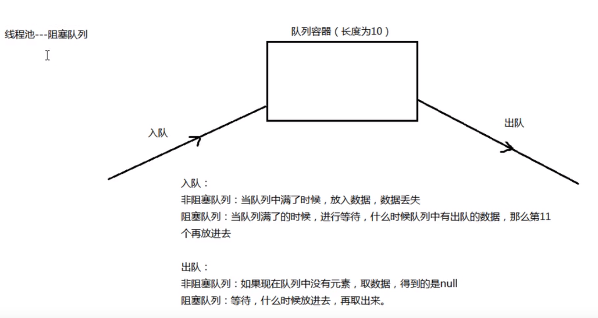
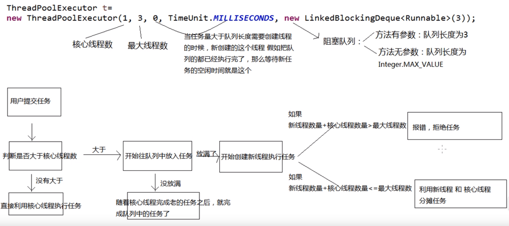

# 线程池的使用

## 1.为什么使用线程池

​	在没有使用线程池的情况下，当我们使用线程的时候就去创建一个线程，这样实现起来非常简便，但是就会有一个问题：如果并发的线程数量很多，并且每个线程都是执行一个时间很短的任务就结束了，这样频繁创建线程就会大大降低系统的效率，因为频繁创建线程和销毁线程需要时间。而在$java​$中，通过线程池**使线程可以复用，**就是执行完一个任务，并不被销毁，而是可以继续执行其他的任务。

## 2.并发队列

1. 并发队列分为两种，一种是阻塞队列，一种是非阻塞队列。而Java线程池使用的就是阻塞队列。

2. 两种并发队列的区别：

## 3.ThreadPoolExecutor类及实现原理

先放一张图：

注：刚开始的时候，线程池中的线程数为0，只有当任务到来时，才开始创建新的线程。

1. ThreadPoolExecutor类的构造放法

~~~java
public class ThreadPoolExecutor extends AbstractExecutorService {
    .....
    public ThreadPoolExecutor(int corePoolSize,int maximumPoolSize,long keepAliveTime, TimeUnit unit, BlockingQueue<Runnable> workQueue);
 
    public ThreadPoolExecutor(int corePoolSize,int maximumPoolSize,long keepAliveTime, TimeUnit unit, BlockingQueue<Runnable> workQueue,ThreadFactory threadFactory);
 
    public ThreadPoolExecutor(int corePoolSize,int maximumPoolSize,long keepAliveTime,TimeUnit unit, BlockingQueue<Runnable> workQueue, RejectedExecutionHandler handler);
 
    public ThreadPoolExecutor(int corePoolSize,int maximumPoolSize,long keepAliveTime, TimeUnit unit, BlockingQueue<Runnable> workQueue,ThreadFactory threadFactory, RejectedExecutionHandler handler);
    ...
}
~~~

**参数解释：**

- corePoolSize：核心池的大小，这个参数跟后面讲述的线程池的实现原理有非常大的关系。在创建了线程池后，**默认情况下，线程池中并没有任何线程**，而是等待有任务到来才创建线程去执行任务，除非调用了prestartAllCoreThreads()或者prestartCoreThread()方法，从这2个方法的名字就可以看出，是预创建线程的意思，即在没有任务到来之前就创建corePoolSize个线程或者一个线程。**默认情况下，在创建了线程池后，线程池中的线程数为0，当有任务来之后，就会创建一个线程去执行任务，当线程池中的线程数目达到corePoolSize后，就会把到达的任务放到缓存队列当中；**

- maximumPoolSize：**线程池最大线程数**，这个参数也是一个非常重要的参数，它表示在线程池中最多能创建多少个线程；

- keepAliveTime：**表示线程没有任务执行时最多保持多久时间会终止**。默认情况下，只有当线程池中的线程数大于corePoolSize时，keepAliveTime才会起作用，直到线程池中的线程数不大于corePoolSize，即当线程池中的线程数大于corePoolSize时，如果一个线程空闲的时间达到keepAliveTime，则会终止，直到线程池中的线程数不超过corePoolSize。但是如果调用了allowCoreThreadTimeOut(boolean)方法，在线程池中的线程数不大于corePoolSize时，keepAliveTime参数也会起作用，直到线程池中的线程数为0；

- unit：参数keepAliveTime的时间单位，有7种取值，在TimeUnit类中有7种静态属性：

  ~~~html
  TimeUnit.DAYS;               //天
  TimeUnit.HOURS;             //小时
  TimeUnit.MINUTES;           //分钟
  TimeUnit.SECONDS;           //秒
  TimeUnit.MILLISECONDS;      //毫秒
  TimeUnit.MICROSECONDS;      //微妙
  TimeUnit.NANOSECONDS;       //纳秒
  ~~~

- workQueue：一个阻塞队列，用来存储等待执行的任务，这个参数的选择也很重要，会对线程池的运行过程产生重大影响，一般来说，这里的阻塞队列有以下几种选择：

  ~~~html
  ArrayBlockingQueue;
  LinkedBlockingQueue;
  SynchronousQueue;
  ~~~

**继承关系：**

* ThreadPoolExecutor继承了AbstractExecutorService
* AbstractExecutorService是一个抽象类，它实现了ExecutorService接口。
* ExecutorService继承了Executor接口$，$Executor是一个顶层接口

Executor接口的实现：

~~~java
public interface Executor {
    void execute(Runnable command);
}
~~~

**ThreadPoolExecutor中几个重要的方法：**

~~~java
execute()
submit()
shutdown()
shutdownNow()
~~~

* execute()方法实际上是Executor中声明的方法，在ThreadPoolExecutor进行了具体的实现，这个方法是ThreadPoolExecutor的核心方法，通过这个方法可以向线程池提交一个任务，交由线程池去执行。
* submit()方法也是用来提交任务到线程池的，内部也调用是execute（）方法，不过不同的是他会返回任务执行的结果。
* shutdown（）关闭线程池，调用该方法之后不会立即将线程池关掉，而是等待线程池中的任务执行完毕之后再将线程池关闭。
* shutdownNow（）也是用来关闭线程池，与shutdown（）不同的是，该方法被调用之后，会立即将线程池关闭掉，而不会等待未执行完的线程。

**任务缓冲队列：**

即workQueue，它用来存放等待执行的任务。

workQueue的类型为BlockingQueue\<Runnable>，通常可以取下面三种类型：

1）ArrayBlockingQueue：基于数组的先进先出队列，此队列创建时**必须指定大小；**

2）LinkedBlockingQueue：基于链表的先进先出队列，如果创建时没有指定此队列大小，则**默认为Integer.MAX_VALUE；**

3）synchronousQueue：这个队列比较特殊，它不会保存提交的任务，而是将直接新建一个线程来执行新来的任务。

## 4.使用Executors中的方法创建线程池

1. 使用Executors类中提供的几个常用的静态方法来创建线程池：

~~~java
/** 创建固定容量大小的缓冲池 */
public static ExecutorService newFixedThreadPool(int nThreads) {
    return new ThreadPoolExecutor(nThreads, nThreads,
                                  0L, TimeUnit.MILLISECONDS,
                                  new LinkedBlockingQueue<Runnable>());
}

/** 创建一个缓冲池，缓冲池容量大小为Integer.MAX_VALUE*/
public static ExecutorService newCachedThreadPool() {
    return new ThreadPoolExecutor(0, Integer.MAX_VALUE,
                                  60L, TimeUnit.SECONDS,
                                  new SynchronousQueue<Runnable>());
}

/** 创建容量为1的缓冲池*/
public static ExecutorService newSingleThreadExecutor() {
    return new FinalizableDelegatedExecutorService
        (new ThreadPoolExecutor(1, 1,
                                0L, TimeUnit.MILLISECONDS,
                                new LinkedBlockingQueue<Runnable>()));
}
~~~

2. 测试代码：

~~~java
import java.util.concurrent.ExecutorService;
import java.util.concurrent.Executors;

public class Test{
    public static void main(String[] args) {
        ExecutorService es = Executors.newCachedThreadPool();

        for(int i = 0; i < 20; ++i){
            es.execute(new Runnable(){
                public void run(){
                    System.out.println(Thread.currentThread().getName());
                }
            });
        }
        
        es.shutdown();
    }
}

/*
pool-1-thread-1
pool-1-thread-5
pool-1-thread-7
pool-1-thread-4
pool-1-thread-3
pool-1-thread-2
pool-1-thread-11
pool-1-thread-1
pool-1-thread-5
pool-1-thread-7
pool-1-thread-4
pool-1-thread-3
pool-1-thread-10
pool-1-thread-9
pool-1-thread-8
pool-1-thread-6
pool-1-thread-14
pool-1-thread-13
pool-1-thread-12
pool-1-thread-2
*/
~~~

