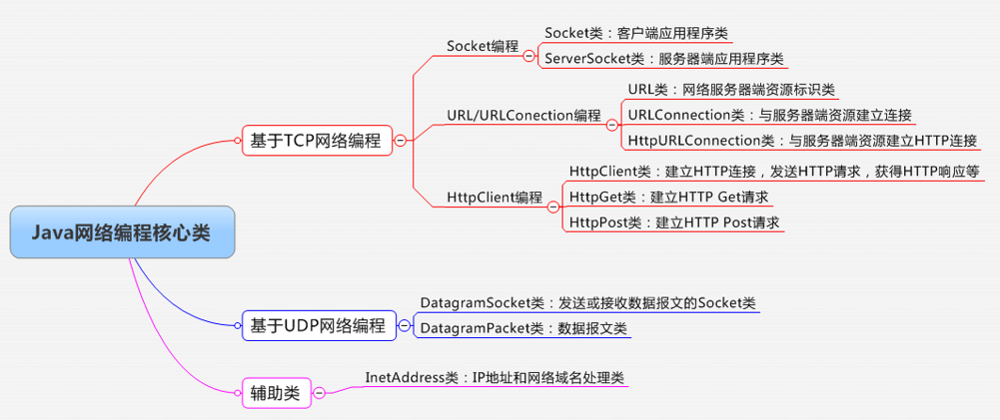
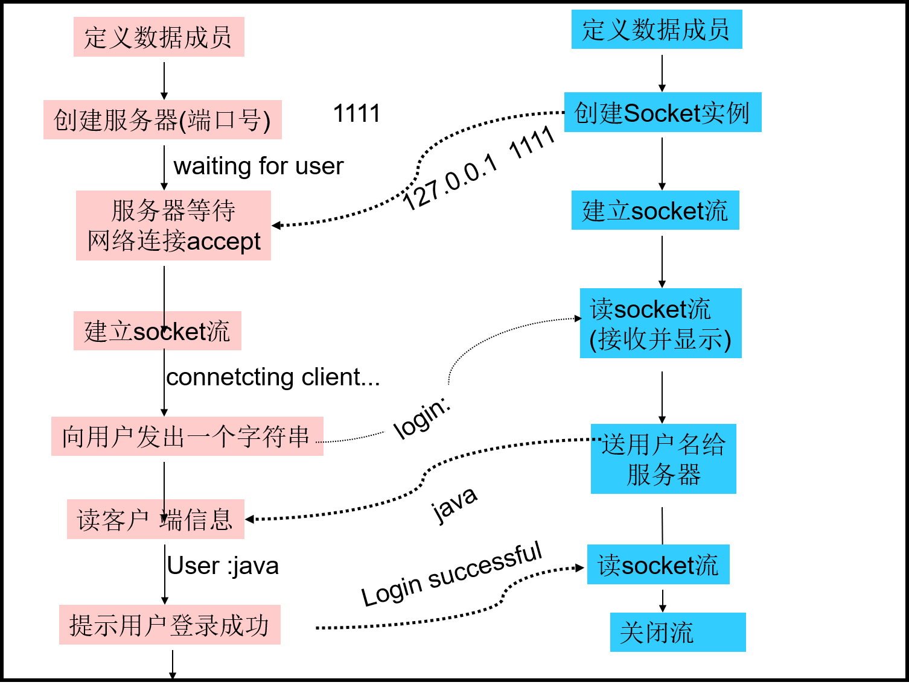

# 网络编程

## 1.网络基本知识

1. 计算机网络的定义：将地理位置不同的具有独立功能的多台计算机及其外部设备，通过通信线路连接起来，在网络操作系统，网络管理软件及网络通信协议的管理和协调下，实现资源共享和信息传递的计算机系统。

2. 为了准确地定位网络上的目标主机，网络中的每个设备都会有一个唯一的数字标识（一个网卡一个IP），即网络设备的**IP地址**，由于IP地址记忆不便，所以通过**域名**来代替IP地址。

3. 通过IP地址可以精确的定位一个网络中的主机，但还是无法确定客户具体访问该主机上的哪一个应用程序，所以出现了端口，一个端口对应一个应用程序。在主机中，端口号1~1024是系统保留端口号，用来为常用的网络服务程序所占用。用户自定义应用程序，最好占用其它端口号。例如：HTTP服务默认占用80端口，FTP服务占用21端口，SMTP服务占用25端口，HTTPS服务默认占用443端口等。

4. 两种数据的传输方式：

   1）TCP传输控制协议：是一种**面向连接的、可靠的、基于字节流**的传输层通信协议。需要首先在网络两端建立安全连接，再进行数据传递，确保网络双方完整无误地传输数据。但是**效率较低**。

   2）UDP用户数据报协议：是一种无连接的传输层协议，提供面向事务的**简单不可靠**信息传送服务。无需建立网络双方连接，直接发送数据包（包含目的地址信息），可能会因为网络问题导致数据传输失败等问题，但是**传输速度很快**，常用于局域网中传输数据。

## 2.网络编程基本概念

1. **网络编程：**指通过编程方式实现两个（或多个）设备之间的**数据传输**。既可以采用TCP的方式，又可以采用UDP的方式。

2. 两种开发模式：

   1）B/S模式

   2）C/S模式

3. 在网络编程中，C/S模式应用程序的开发，需要同时开发客户端应用程序和服务器端应用程序：

   1）客户端应用程序的开发步骤：

   * 客户端建立与服务器端的连接（通过IP地址和端口确定服务器端程序）

   * 客户端封装请求数据，发送给服务器端；客户端获得服务器端响应数据，解析并处理数据

   * 客户端关闭网络连接

   2）服务器端应用程序的开发步骤：

   * 服务器端监听特定端口
   * 服务器端接收客户端连接
   * 服务器端接收客户端请求数据，解析并处理请求数据；服务器端封装响应数据，发送给客户端端
   * 服务器端关闭网络连接

## 3.Java网络编程核心类

1. 一张图：

2. URL类的使用：

~~~java
/** 下载一张图片*/
package test11;

import java.io.FileOutputStream;
import java.io.InputStream;
import java.io.OutputStream;
import java.net.URL;

public class Main {
	public static void main(String[] args) throws Exception{
		
		String str = "http://202.206.100.217/zftal-ui-v5-1.0.2/assets/images/login_bg_pic.jpg";
		
		//创建URL对象
		URL url = new URL(str);
		
		//打开输入流
		InputStream in = url.openStream();
		
		//创建文件输出流
		OutputStream out = new FileOutputStream("H:/index.jpg");
		
		//输出图片
		byte[] b = new byte[1024];
		int len;
		while((len = in.read(b, 0, 1024)) != -1) {
			out.write(b, 0, len);
		}
		
		out.close();
		in.close();
	}
}
~~~

~~~java
/** 常用方法*/
URL myURL = new URL("http://java.sun.com");

//获得协议
String protocal = myURL.getProtocol();

//获得主机号
String host = myURL.getHost();

//得到文件路径
String file = myURL.getFile();

//获得端口
int port = myURL.getPort();

//获得锚节点
String ref = myURL.getRef();
~~~

3. URLConnection类的使用：
4. HttpURLConnection类的使用：

## 4.基于套接字的Java网络编程（TCP）

### 1.基本原理

1. 客户端和服务器端建立连接后，连接两端将会建立一个虚拟“线缆”，在网络编程中称之为**Socket（套接字）**（IP地址 + 端口号）；其后在网络两端传输数据都是通过Socket进行的。

   1）Socket借助**IP地址和端口号**，对应某一台主机中的某一个应用程序

   2）Socket的主要作用是维护网络连接、在网络双方传输数据

### 2.Socket网络编程核心操作类

#### 1.客户端

1. **Socket类**：客户端套接字类。实现客户端向服务器发送数据、接收服务器数据等功能；实现服务器端向客户端发送数据、接收客户端数据等功能。
2. Socket = IP + Port；可以唯一确定一个应用程序

~~~java
//构造方法：
Socket(InetAddress  address, int  port);
Socket(String  host,  int  port);  

//常用方法：
getInputStream();	// 获得网络输入流
getOutputStream();	// 获得网络输出流
close();		    // 关闭Socket连接
~~~

3. 客户端的主要任务：

   1）建立连接

   2）接收数据和发送数据

   3）关闭连接

#### 2.服务器端

1. **ServerSocket类**：服务器端套接字类。**监听服务器指定端口**，接收客户端连接请求。

~~~java
//构造方法：
ServerSocket(int  port)；

//常用方法：
accept();	// 用于产生“阻塞”，直到接收一个连接，返回客户端Socket对象
close();	// 关闭服务器端Socket监听
~~~

2. 服务器端的主要任务：

   1）监听特定的端口

   2）接收客户端连接

   3）接收客户端请求，向客户端发送响应

   4）关闭连接

#### 3.实现聊天（小例子）

~~~java
/** 客户端*/
package socket;

import java.io.*;
import java.net.*;
import java.util.*;

public class ClientThread implements Runnable {

	@Override
	public void run() {
		
		Scanner cin = new Scanner(System.in);
			
		try {
			
			while(true) {
				//相当于创建一次连接，通过死循环进行多次访问
				Socket socket = new Socket("127.0.0.1", 8888);
				
				//获得网络输出流
				OutputStream os = socket.getOutputStream();
				String str = cin.nextLine();
				byte[] b1 = str.getBytes();
				os.write(b1);
				os.flush();
				
				//检测输入信息，判断是否终止，跳出循环，线程终止
				if("exit".equals(str)) {
					break;
				}
				
				//获得网络输入流
				InputStream is = socket.getInputStream();
				byte[] b2 = new byte[1024];
				is.read(b2);
				System.out.println(new String(b2));
				
				is.close();
				os.close();
				socket.close();
			}
		} catch(Exception e) {
			e.printStackTrace();
		}
			
		cin.close();
	}
}
~~~

~~~java
/** 服务器端*/
package socket;

import java.io.InputStream;
import java.io.OutputStream;
import java.net.ServerSocket;
import java.net.Socket;
import java.util.Scanner;

public class ServerThread implements Runnable{

	@Override
	public void run() {

		Scanner cin = new Scanner(System.in);
		try {
			//创建ServerSocket
			ServerSocket serversocket = new ServerSocket(8888);
			while(true) {
				//监听指定端口
				Socket socket = serversocket.accept();
				
				//获得客户端的网络输入流
				InputStream is = socket.getInputStream();
				byte[] b1 = new byte[1024];
				is.read(b1);
				
				//循环终止条件，如果没有该判断，循环外边的ServerSocket将无法关闭
				if("exit".equals(new String(b1))) {
					break;
				}
				System.out.println(new String(b1));
				
				//获得客户端网络输出流
				OutputStream os = socket.getOutputStream();
				String str = cin.nextLine();
				os.write(str.getBytes());
				
				os.close();
				is.close();
				socket.close();
			}
			serversocket.close();
		} catch(Exception e) {
			e.printStackTrace();
		}
		
		cin.close();
	}
}
~~~

~~~java
/** 启动客户端*/
package socket;

public class ClientTest {
	public static void main(String[] args) {
		Thread thread = new Thread(new ClientThread());
		thread.start();
	}
}
~~~

~~~java
/** 启动服务器端*/
package socket;

public class ServerTest {
	public static void main(String[] args) {
		Thread thread = new Thread(new ServerThread());
		thread.start();
	}
}
~~~

#### 4.实现逻辑

#### 5.单服务器端多线程接收多次通讯

使用socket作为参数，在主线程中监听相应的端口，每当接收到客户端提出的请求之后便建立一个新的线程去处理该客户端的请求。

~~~java
public class MyRunnable implements Runnable {
	private Socket socket;

    public MyRunnable(Socket socket) {
    	this.socket = socket;
    }

    public void run() {
        //处理接收请求返回数据….
    }
}
~~~

## 5.UDP网络编程

### 1.基本概念

1. UDP传输协议：一种无连接的传输层协议，提供面向事务的简单不可靠信息传送服务
2. UDP向服务器传输数据需要通过数据包的形式，数据包中封装服务器的IP地址，端口号等信息。

### 2.UDP网络编程核心类

1. DatagramSocket类：客户端/服务器端网络**Socket端口对象**

~~~java
//构造方法：
DatagramSocket（）;            // 创建一个空的Socket对象
DatagramSocket（int  port）;  // 创建指定监听端口的Socket对象

//常用方法：
void  send（DatagramPacket  p）;          // 发送数据报文
void  receive（DatagramPacket  p）;      // 接收数据报文
~~~

2. 数据报文对象：udp进行传输数据的对象

~~~java
DatagramPacket（byte[]  buf, int len）;  
DatagramPacket（byte[] buf, int offset, int len）;  
DatagramPacket（byte[] buf, int len, InetAddress addr, int port）; 
DatagramPacket（byte[] buf, int offset, int len, InetAddress addr, int port）; 
/**
* buf：用于接受数据的缓冲区的大小
* offset：缓冲区的偏移量
* len：接收的数据的长度
* addr：目的地址
* port：端口号
*/
~~~

### 3.基本流程

1. 客户端：

   1）创建DatagramSocket对象

   2）封装请求数据，创建DatagramPacket对象

   3）发送请求

2. 服务器端：

   1）创建DatagramSocket对象，监听特定端口

   2）创建DatagramPacket对象（空缓冲区）

   3）接收客户端请求

   4）封装服务器响应数据，创建DatagramPacket对象

   5）发送服务器响应给指定客户端

### 4.小例子

1. 客户端：

~~~java
package udptest;

import java.net.DatagramPacket;
import java.net.DatagramSocket;
import java.net.InetAddress;
import java.net.SocketException;

public class ServerTest {

	public static void main(String[] args) {
		try {
			//1、构造socket
			DatagramSocket datagramSocket = new DatagramSocket();
			//2、构造数据报文
			DatagramPacket datagramPacket = new DatagramPacket(
					"helloworld".getBytes(),
					"helloworld".getBytes().length,
					InetAddress.getByName("127.0.0.1"),
					8888);
			datagramSocket.send(datagramPacket);
			
		} catch (Exception e) {
			e.printStackTrace();
		}
	}
}
~~~

2. 服务器端：

~~~java
package udptest;

import java.net.DatagramPacket;
import java.net.DatagramSocket;
import java.net.SocketException;

public class ClientTest {

	public static void main(String[] args) {
		try {
			DatagramSocket datagramSocket = new DatagramSocket(8888);
			byte[] buf = new byte[1024];
			DatagramPacket datagramPacket = new DatagramPacket(buf, buf.length);
			
			datagramSocket.receive(datagramPacket);
			
			byte[]cache = datagramPacket.getData();
			datagramPacket.getAddress();
			
			System.out.print(new String(cache));
		} catch (Exception e) {
			e.printStackTrace();
		}
	}
}
~~~

