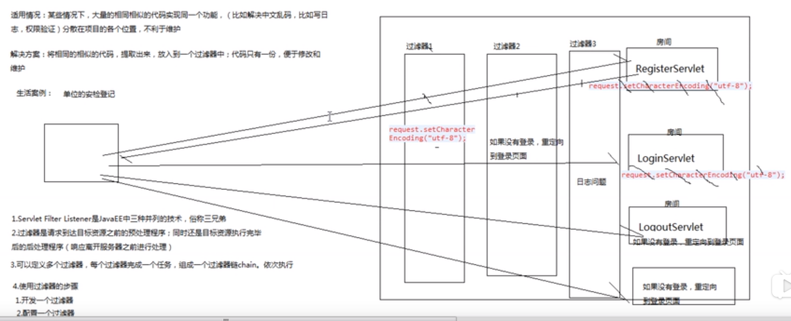
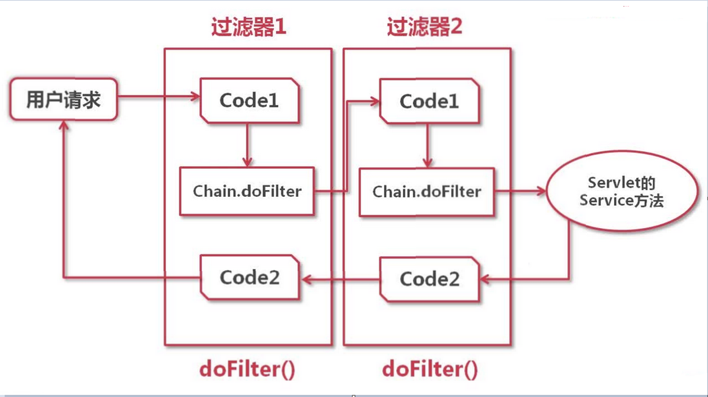

# 过滤器

## 1. 过滤器的简单介绍

> 适用情况：
>
> 1. 在某些情况下，大量相同相似的代码实现同一个功能（比如解决中文乱码问题，权限验证等），代码 分散在整个项目的各个位置，不利于维护
> 2. 使用过滤器，将相同相似的代码全部放入过滤器之中，当请求响应页面的时候直接先通过过滤器，这样这些代码便只用写一遍即可。
> 3. 过滤器可以截取客户端和服务器目标资源之间的请求和响应信息。

## 2. 过滤器的使用

**1. 过滤器中需要实现的方法**

* 初始化
* 实现过滤器的功能
* 销毁

~~~java
	/**
	 * @see Filter#destroy()
	 * 销毁方法，只会执行一次
	 */
	public void destroy() {
		// TODO Auto-generated method stub
	}

	/**
	 * @see Filter#doFilter(ServletRequest, ServletResponse, FilterChain)
	 * 相当于servlet的service方法，每次请求均会执行一次
	 */
	public void doFilter(ServletRequest request, ServletResponse response, FilterChain chain) throws IOException, ServletException {

	}

	/**
	 * @see Filter#init(FilterConfig)
	 * 初始化操作，只会执行一次
	 */
	public void init(FilterConfig fConfig) throws ServletException {
		// TODO Auto-generated method stub
	}
~~~

> 注意：
>
> * 实现Filter接口

**2. 过滤器的配置**

在web.xml中进行配置，和servlet的配置类似

~~~xml
<filter>
    <filter-name>EncodingFilter</filter-name>
    <filter-class>filter.EncodingFilter</filter-class>
</filter>

<filter-mapping>
    <filter-name>EncodingFilter</filter-name>
    <url-pattern>/Servlet/*</url-pattern>
</filter-mapping>
~~~

> 注意：
>
> * 与servlet配置不同的地方是url-pattern，该出路径的含义是在访问该处指定路径的文件时需要经过指定的过滤器

## 3. 过滤器的原理

**1. 过滤器的拦截顺序**

和web.xml中配置的\<filter-mapping\>顺序有关。按照配置的顺序执行。

**2. 哪些请求和响应经过滤器**

在web.xml文件中的过滤路径中配置的路径下的文件。

**3. 过滤器中代码的执行过程**

> * 职责链模式

**4. 转发和重定向是否经过过滤器**

转发一般情况下不经过，重定向经过。但是经过简单的配置之后，也可以是转发请求经过过滤器。

## 4. 过滤器总结

**总结：**

* 过滤器是驻留在服务器端的web组件，可以截获客户端和目标资源之间的请求和响应信息，并对这些信息进行预处理。
* 过滤器可以实现的功能：编码的转化，身份验证，数据压缩，数据加密和日志记录等。

